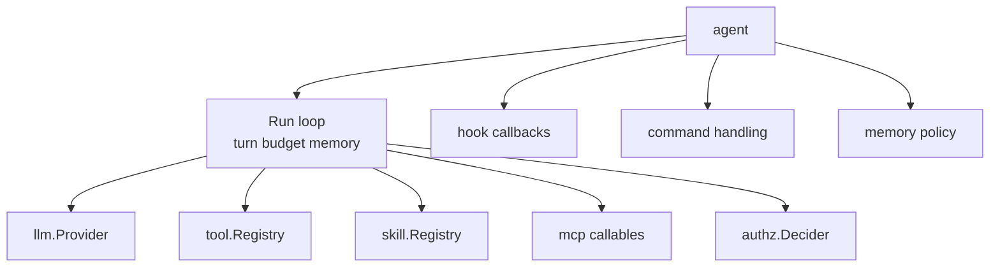

# gokit/agent

`agent` owns the bounded LLM/tool loop. Defaults are bounded: `MaxTurns=10`, `WallClock=60s`,
`MaxTokens=100000`, `MaxToolCalls=50`, `ToolConcurrency=4`, and `ToolTimeout=30s`.

## Install

```bash
go get github.com/kbukum/gokit/agent
go get github.com/kbukum/gokit/llm
go get github.com/kbukum/gokit/llm/providers/ollama
```

## Architecture



## Quick start

```go
package main

import (
	"context"
	"fmt"

	"github.com/kbukum/gokit/agent"
	"github.com/kbukum/gokit/ai/chat"
	"github.com/kbukum/gokit/llm"
	"github.com/kbukum/gokit/llm/providers/ollama"
)

func main() {
	registry := llm.NewDialectRegistry()
	if err := ollama.Register(registry); err != nil {
		panic(err)
	}

	adapter, err := llm.New(registry, llm.Config{
		Dialect: ollama.DialectName,
		BaseURL: ollama.DefaultBaseURL,
		Model:   "llama3.2",
	})
	if err != nil {
		panic(err)
	}

	provider := llm.NewProvider(adapter, "llama3.2")
	runner := agent.New(agent.Config{
		Provider:     provider,
		Model:        "llama3.2",
		SystemPrompt: "You are concise and operationally precise.",
	})

	result, err := runner.Run(context.Background(), []chat.Message{
		chat.User("Write a two-line release summary."),
	})
	if err != nil {
		panic(err)
	}

	fmt.Println(result.FinalMessage.Text())
}
```

## When to use

Use `agent` when you want the bounded turn loop, budgets, tool dispatch, hooks,
and memory policy in one place instead of building an orchestration loop yourself.
