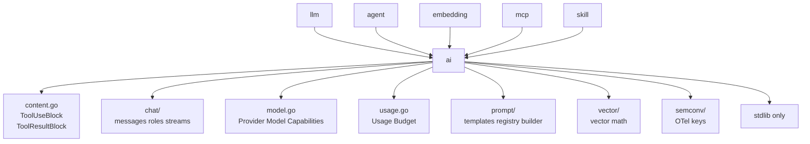

# gokit/ai

`ai` owns shared AI/ML value types only: content blocks, chat messages, models, usage, streams, prompts, vectors, and OTel semantic conventions.

## Architecture

```mermaid
flowchart TD
    AI[ai]
    Content[content.go\nToolUseBlock\nToolResultBlock]
    Chat[chat/\nmessages roles streams]
    Model[model.go\nProvider Model Capabilities]
    Usage[usage.go\nUsage Budget]
    Prompt[prompt/\ntemplates registry builder]
    Vector[vector/\nvector math]
    Semconv[semconv/\nOTel keys]
    Std[stdlib only]
    LLM[llm]
    Agent[agent]
    Embedding[embedding]
    MCP[mcp]
    Skill[skill]

    AI --> Content
    AI --> Chat
    AI --> Model
    AI --> Usage
    AI --> Prompt
    AI --> Vector
    AI --> Semconv
    AI --> Std
    LLM --> AI
    Agent --> AI
    Embedding --> AI
    MCP --> AI
    Skill --> AI
```
