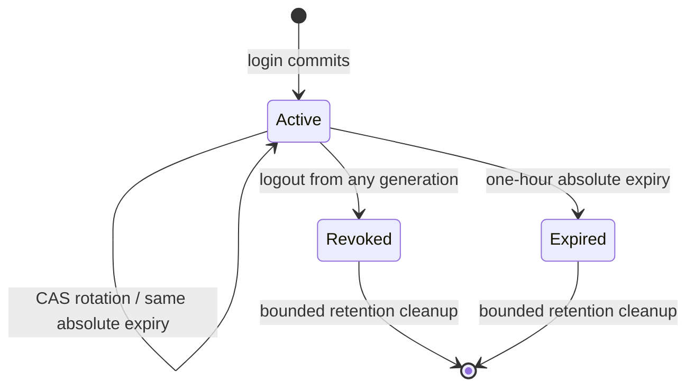

# Opaque browser sessions

Use `session.Manager` for same-origin HTTPS browsers and `apikey.Manager` for CLI/CI callers. Inject both into `auth.NewChain(sessionManager, keyManager)` and wrap protected handlers with `server/middleware.HTTPAuth(chain, authctx.Set[auth.Principal])`. Missing credentials are rejected by default; `WithMissingPolicy(AcceptMissing)` dispatches them **without storing an identity**, so required guards still reject them. Invalid or ambiguous credentials always fail.

## Compose the owners

1. Open a production `database.DB`. Select `database/sqlite` for local use; `database/postgres` is opt-in.
2. Apply `session/database.Migrations(db, sqlite.MigrateDriver()).Up(ctx)` and call `Ready(ctx, database.SchemaVersion)`. Session migrations track their version in `auth_session_schema_migrations`, separate from the application's `schema_migrations`, so the two sets can run in any order on one database. PostgreSQL uses `postgres.MigrateDriver()`. Never use AutoMigrate.
3. Borrow the database with `session/database.NewStore(db)`. An optional `util.Clock` argument supports deterministic integration tests.
4. Create `security.NewSignedCSRF(csrfSecret, rand.Reader)`. The CSRF secret and session pepper must be **independent**, at least 32 bytes each, and shared across instances. Inject `util.SystemClock{}` and `rand.Reader` into `session.Config`.
5. Call `session.NewManager(config)`, then `session.NewLocalBackend(manager, verifier)` and `session.NewHandler(backend, session.HandlerConfig{Origin: "https://your-host", Errors: errorWriter, Clock: util.SystemClock{}})`. `LoginVerifier.VerifyLogin(ctx, session.Login)` returns an application-verified principal with subject, kind and explicit restrictions. It does not encode workspace membership. `ErrorWriter` is the outer transport's normalizer; expose only approved application failure fields, never causes.
6. Close the manager before the borrowed database. `Close(ctx)` synchronously cancels local stream lifetimes and waits for its owned watch/cleanup workers.

**Remote session authority:** a gateway that does not own session state implements `session.Backend` (`SignIn`, `Status`, `SignOut`) over its own client and passes it to `NewHandler`. The handler still enforces the whole browser contract before calling the backend: exact origin, JSON limits, cookie shape and exactly one `X-CSRF-Token` on logout. It also rejects a returned grant whose principal is not a valid session identity (`Credential` must be `auth.Session`), is already expired or has no CSRF token. `HandlerConfig.Errors` receives backend errors with their causes and must normalize them. `session.RequestCSRF(r)` exposes the same header rule to other unsafe cookie routes, so a gateway can fail `CSRF_INVALID` before it forwards a request.

`session.Config.Clock` is the injected `util.Clock` owning absolute session expiry and retention dates. Independent `util.MonotonicClock` runtime timing owns stream leases, polling and cleanup cadence: a frozen domain clock or backward wall-clock adjustment cannot stop them. Tests use `testing/synctest` for deterministic monotonic timing rather than advancing domain time to drive transport timers.

## HTTP contract

| Method and route | Request | Success |
|---|---|---|
| `POST /auth/login` | Exact configured `Origin`; `Content-Type: application/json`; username/password JSON, at most 4 KiB | 200 session response plus session cookie |
| `GET /auth/session` | Session cookie | 200 session response; **never Set-Cookie** |
| `POST /auth/logout` | Session cookie and `X-CSRF-Token` | 204 after committed family revocation; deletion cookie |

Login and status return:

```json
{"status":"authenticated","identity":{"subject":"user-123","kind":"user","restrictions":{"mode":"unrestricted"}},"expiresAt":"2026-01-01T01:00:00Z","csrfToken":"<signed-generation-bound-token>"}
```

Identity contains no cookie, protected credential reference, IdP token or application-specific membership. The cookie is named `__Host-session` and always has `Secure; HttpOnly; SameSite=Strict; Path=/`, no Domain, and one-hour expiry. HTTPS is required locally too: use a locally trusted certificate and trust it explicitly in browser and readiness clients. Never disable certificate verification or weaken cookie flags.

Only unsafe **cookie-authenticated** requests need one `X-CSRF-Token` header, including Connect POST and logout. Header API keys need neither cookie nor CSRF. CSRF tokens contain a cryptographic nonce and HMAC signature bound to the protected generation reference; they cannot cross sessions or generations. They are at most 256 bytes. Login has no synchronizer token yet and instead requires exact Origin plus JSON.

The chain accepts exactly one `__Host-session` cookie or one `X-API-Key` header. Empty, duplicate, mixed and reserved unsupported `Authorization` credentials fail closed. Session credentials are exactly 43 canonical base64url characters encoding 32 random bytes. API keys are at most 512 bytes and resolve through an indexed HMAC digest, not prefix scans.

The shared credential-protection helper includes a versioned HMAC domain prefix: API keys use `"apikey"` and sessions use `"session"`. Identical credential material and pepper produce different digests across these domains. API-key validation never performs a usage-metadata write; optional usage observation is an explicit separate store operation.

## Lifetimes and rotation



Every generation points to one transactional family; an old generation can still revoke all its replacements.

`Create(ctx, principal)` returns `Issued{Token, Principal}` once. Persist only protected digests. `Rotate(ctx, principal.Reference, newPrincipal)` changes the identifier and restrictions but preserves subject, kind and absolute expiry. Only one concurrent rotation wins. There is no grace, automatic retry, cookie renewal or refresh endpoint. A committed rotation with a lost response may require another login; cancellation is not proof a mutation did not commit.

Login has two phases around the application's password check: `BeginLogin(ctx, presentedCookie)` runs before verification and `CompleteLogin(ctx, attempt, verifiedPrincipal)` runs after it. The HTTP login handler uses both. `BeginLogin` captures the cookie's state up front, so a logout that commits during verification still wins. It rejects credential ambiguity, malformed cookies, unsupported header credentials, corrupt records and store failures before any password work.

- **Active at begin:** the generation is atomically replaced through `Store.Relogin`. Password verification may change identity or restrictions, but an unexpired family's absolute expiry is preserved. Old-generation local streams are canceled before success, and logout from any retained generation revokes the replacement. If the family was revoked or superseded during verification, login fails and sets no cookie.
- **Already revoked or superseded at begin:** the cookie is terminal. Login revokes its whole family, cancels its streams, and only then issues a fresh family. A browser stuck with a stale HttpOnly cookie, for example after a lost rotation or logout response, recovers by logging in, while every generation of the old family stays fenced.
- **Failures:** failed authoritative lookups or revocations never recover.

An explicitly missing credential may establish a fresh family after password verification. An expired but still active, non-revoked generation may atomically establish a new one-hour lifetime through strong authentication; all family tombstones are retained through that lifetime plus ten minutes. Its CAS still loses to committed logout. Cookie-less initial logins have no existing generation to compare and establish independent families, including overlapping initial requests. Clients must serialize initial login/logout and generation-fence late responses; the server cannot correlate unrelated cookie-less requests without a separate client identity. A lost initial response leaves an inaccessible family until expiry, never a recoverable plaintext credential. Status never sets cookies.

`Logout(ctx, protectedReference)` revokes the family even if the supplied generation is inactive. HTTP logout verifies its generation-bound CSRF token directly before revocation, allowing an old generation's cookie and CSRF token to revoke a replacement. Logout is idempotent while the tombstone exists. Every authentication lookup uses authoritative writer state; store failures never become anonymous or success-shaped responses.

Lookup/status calls have a 500 ms budget, mutations 2 seconds, and login 5 seconds. Admission budgets start before waiting for the context-aware local revocation gate: acquisition waits count toward 500 ms, while create/rotate/logout waits count toward 2 seconds. Canceling the caller interrupts a contended gate. Authentication uses the revised application category plus semantic reason, such as `SESSION_INVALID`, `CSRF_INVALID`, `AUTH_STORE_UNAVAILABLE` or `CREDENTIAL_CEILING`. Terminal authentication failures stop protected activity; store errors do not certify authenticated success.

## Authorization is an intersection

`Principal.Allows(resource, scopes...)` checks a credential ceiling only. Unrestricted credentials still need application membership. Restricted credentials with empty resource or scope lists grant nothing for those dimensions. Call `auth.Authorize(ctx, applicationPolicy, principal, resource, scopes...)` to intersect the ceiling with application-owned authorization. Matching an API key resource never creates membership.

## Protected streams

Call `manager.Acquire(ctx, principal.Reference)` immediately before admitting a protected stream. It returns `(lifetime context.Context, release func(), err error)`. Use the authoritative lifetime for SSE and always call the idempotent release callback when the stream ends. Admission's final authoritative read is coordinated with local revocation; transport cancellation is also propagated.

The manager allows at most 1,024 active acquisitions. Local committed logout cancels matching streams **before returning success**. Rotation cancels old-generation streams. Every instance revalidates active protected references every second. Each read renews a fail-closed lease measured from **monotonic read start**, never completion; a separate expiry worker cancels at the three-second lease deadline even while a driver ignores cancellation. This timing is independent of domain time. Admission also translates remaining absolute session lifetime into a non-renewable monotonic deadline, capped at one hour, so backward domain adjustments cannot extend an admitted stream. Expiry, generation change, revocation, store failure and manager shutdown all cancel lifetimes. Cross-instance release has a four-second ceiling. The stream owner remains responsible for promptly reacting to cancellation and preserving its existing admission/write limits.

Interactive clients serialize login/logout, generation-fence late status responses, and perform one bounded single-flight status check before reconnecting a closed protected stream. Local logout teardown is not proof server revocation committed when the logout request failed.

## Retention and bounded cleanup

Family and generation tombstones remain until absolute expiry plus ten minutes. Every ten seconds, the manager calls one 500 ms cleanup batch deleting at most 256 physical rows. The database adapter deletes due generations before orphaned families and retains migration metadata. The 41-second healthy-store bound applies to **1,024 due physical rows**, not arbitrary larger backlogs or 1,024 families with additional generations. Cleanup failures are fail-closed for watched lifetimes.

## Validate

```sh
cd auth
go test -race -shuffle=on -count=1 -cover ./...
cd session/database
go test -race -shuffle=on -count=1 -cover ./...
go test -tags=integration -race -shuffle=on -count=1 -run TestPostgresTransactionalFamily
```

The PostgreSQL integration gate requires reachable Docker and the database owner's digest-pinned image; missing prerequisites are failures, never skipped successes. Behavioral tests cover old-generation logout, lost rotation responses, CAS, expiry, independent stalled-read leases, storage failure, cleanup retention, capacity, JSON/CSRF limits and owned goroutine shutdown. Protocol fixtures live in [testdata](testdata/).
