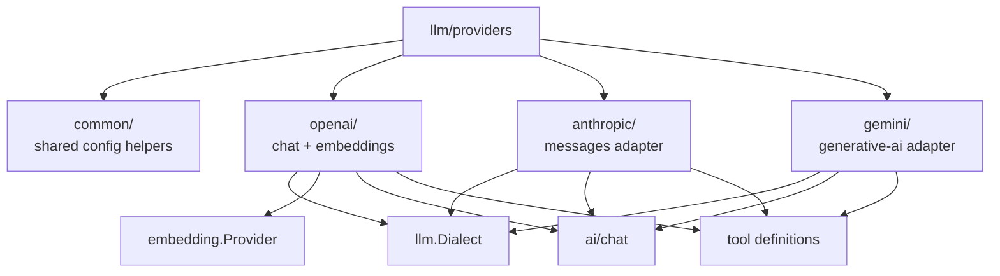

# gokit/llm/providers

`llm/providers` contains opt-in provider adapters that implement `llm.Dialect` plus provider-specific embedding bridges where they belong.

## Architecture



## Providers

| Provider | Role | Status |
| --- | --- | --- |
| OpenAI | Chat + embeddings via OpenAI-compatible API | ✅ Implemented |
| Anthropic | Claude messages adapter | ✅ Implemented |
| Gemini | Gemini chat adapter | ✅ Implemented |
| Ollama | First-class local/provider-hosted dialect using the OpenAI-compatible wire shape | ✅ Implemented |

## Install

```bash
go get github.com/kbukum/gokit/llm/providers/ollama
```

## Quick start

```go
package main

import (
	"context"
	"fmt"

	"github.com/kbukum/gokit/ai/chat"
	"github.com/kbukum/gokit/llm"
	"github.com/kbukum/gokit/llm/providers/ollama"
)

func main() {
	registry := llm.NewDialectRegistry()
	if err := ollama.Register(registry); err != nil {
		panic(err)
	}

	client, err := llm.New(registry, llm.Config{
		Dialect: ollama.DialectName,
		BaseURL: ollama.DefaultBaseURL,
		Model:   "llama3.2",
	})
	if err != nil {
		panic(err)
	}

	resp, err := client.Execute(context.Background(), llm.CompletionRequest{
		Messages: []chat.Message{chat.User("Return one sentence about local inference.")},
	})
	if err != nil {
		panic(err)
	}

	fmt.Println(resp.Text())
}
```

## When to use

Import only the providers you actually ship. Registration is explicit so composition stays predictable and there are no package-init side effects.
