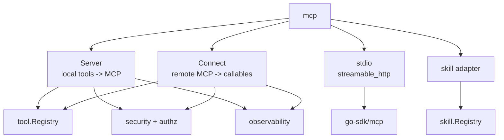

# gokit/mcp

`mcp` bridges gokit's `tool.Registry` with MCP servers and remote MCP tool imports.

## Architecture

```mermaid
flowchart TD
    MCP[mcp]
    Server[Server\nlocal tools -> MCP]
    Client[Connect\nremote MCP -> callables]
    Transport[stdio\nstreamable_http]
    SkillAdapter[skill adapter]
    ToolReg[tool.Registry]
    SkillReg[skill.Registry]
    Security[security + authz]
    Obs[observability]
    SDK[go-sdk/mcp]

    MCP --> Server
    MCP --> Client
    MCP --> Transport
    MCP --> SkillAdapter
    Server --> ToolReg
    Client --> ToolReg
    SkillAdapter --> SkillReg
    Server --> Security
    Client --> Security
    Server --> Obs
    Client --> Obs
    Transport --> SDK
```
