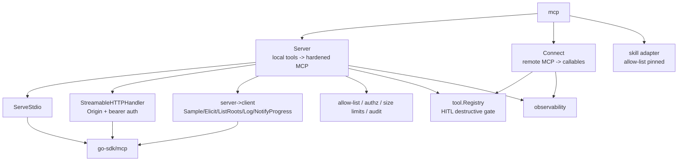

# gokit/mcp

`mcp` is a hardened,
protocol-shaped [Model Context Protocol](https://modelcontextprotocol.io/) server
and client backed by gokit's `tool.Registry`.
The official [`modelcontextprotocol/go-sdk`](https://github.com/modelcontextprotocol/go-sdk) owns the protocol wire (tools, prompts, resources + templates, subscribe, roots, sampling, elicitation, logging, progress, cancellation) over the **stdio**
and **Streamable HTTP** transports; this package is the typed, fail-closed facade on top of it.

## Server hardening chain

Every `tools/call` runs a fail-closed chain —
any step short-circuits to an audited MCP error result:

```
allow-list → input-size limit → schema validation → authorization
  → registry dispatch (destructive-tool human gate) → result-size limit
  → output schema validation → audit
```

Prompts and resources share the capability allow-list and audit;
server→client helpers (`Sample`, `Elicit`, `ListRoots`, `Log`, `NotifyProgress`) treat model output
and elicited content as untrusted (size-limited and audited) and guard against nil sessions.

Untrusted client/model payloads are carried as `json.RawMessage`;
documented JSON-Schema is `schema.JSON`.
No `interface{}`/`any` on exported surfaces beyond those documented opaque types.

## Transports

- **stdio** — `Server.ServeStdio(ctx)` for local, single-client integrations (IDEs, agents).
- **Streamable HTTP** —
  `Server.StreamableHTTPHandler(cfg, token)` wraps the SDK handler with Origin cross-origin protection
  and optional constant-time bearer-token auth. Localhost (loopback) protection is on by default.

## Architecture



See [`CONFORMANCE.md`](CONFORMANCE.md) for the full 2025-06-18 capability matrix.
Remote MCP servers are tool sources, not skills; skill manifests live in `gokit/skill`.
