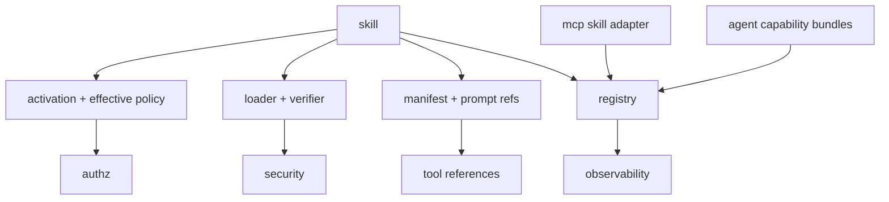

> **Note:** This `skill` primitive borrows the `SKILL.md` filename
> and progressive-disclosure model from Anthropic Agent Skills. It is a distinct primitive
> and makes no interop claim with the Anthropic runtime.

# gokit/skill

`skill` owns `kit.skill.yaml` manifests, progressive-disclosure loading, in-process skill providers,
signature verification seams, and activation envelope helpers.

## Architecture

