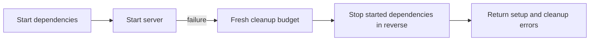

# TestUtil - Testing Infrastructure for gokit

The `testutil` package provides a comprehensive testing infrastructure for gokit components, following the same lifecycle patterns as production components. It enables easy setup, teardown, and management of test components with support for state snapshots and resets.

## Owned environments

`Manager` and `Setup` accept production `component.Component` implementations as well as test adapters. Register dependencies first. Startup failure unwinds only successful starts in reverse order; the failing component must release its own partial acquisition. Startup and cleanup errors are joined, so `errors.Is` can inspect both.

```go
manager := testutil.NewManager(t.Context(), testutil.WithBudgets(testutil.Budgets{
    Setup: 30 * time.Second,
    Cleanup: 10 * time.Second,
}))
if err := manager.Add(dbComponent); err != nil {
    t.Fatal(err)
}
if err := manager.Add(serverComponent); err != nil {
    t.Fatal(err)
}
t.Cleanup(func() {
    if err := manager.Cleanup(); err != nil {
        t.Error(err)
    }
})
if err := manager.StartAll(); err != nil {
    t.Fatal(err)
}
```

Setup/reset defaults to 30 seconds. Cleanup preserves context values but gets a **fresh 10-second budget**, independent of test cancellation. Components share the remaining cleanup time. Lifecycle operations are serialized; duplicate names, registration while running, and double startup are errors. Repeated cleanup returns the recorded result without repeating teardown. A stopped manager can be started explicitly again; it never restarts automatically.



A failed start returns both the original failure and rollback failures.

**Reset is not restart.** Server and Connect fixtures preserve handlers and the live origin on reset. Clear application data separately, with requests quiesced, and reset before signing in. Use Stop/Start for an owned restart. HTTP teardown drains for at most the stop deadline (10 seconds without a shorter deadline), then closes remaining owned connections and returns the deadline/cancellation error. Handlers must honor request cancellation: Go cannot forcibly stop arbitrary handler code.

| Proof | Helper and boundary |
|---|---|
| Deterministic lifecycle failures | `component/testutil.Component` doubles; no database or network claim |
| HTTP/SSE and Connect | `server/testutil` and TLS/HTTP2 `connect/testutil`; real loopback connections, not a consumer binary |
| Small SQL unit fixtures | `database/testutil` in-memory SQLite/AutoMigrate; not production migration or persistence proof |
| Production SQLite | Inject `database/sqlite` and actual SQL migrations into `database/testutil.Component`, using `t.TempDir()` |
| Production PostgreSQL | `database/postgres/testutil.Start`; isolated, digest-pinned container; Docker absence fails |
| Owned child processes | `process.StartPersistent` and `Supervisor`; argv-only, isolated environment, explicit shutdown outcome |

Run these gates from the repository root with Go 1.27.1, a C compiler for SQLite, and a reachable Docker daemon for PostgreSQL:

```sh
toven --no-cache test --module go:testutil --module go:server-testutil --module go:connect-testutil --module go:database-testutil --module go:database-sqlite -- -race -shuffle=on -count=1 -timeout=3m
go test ./process -race -shuffle=on -count=1 -timeout=3m
toven --no-cache test --module go:database-postgres -- -tags=integration -race -shuffle=on -count=1 -timeout=10m
```

The local-only commands do **not** certify PostgreSQL. The required integration command fails on missing Docker, failed provisioning, or failed termination; no implicit skip is allowed. Lifecycle, loopback, SQLite, and process packages run leak checks. Live-connection tests use a 50 ms drain and 2-second settling ceiling; process tests use 50 ms grace and a 2-second reaping ceiling. Small snapshots/fixtures are limited to 32 tables, 1,000 rows, and 1 MiB encoded data.

Use unique temporary paths and actual bound ports. `process.StartPersistent` retains at most 64 KiB per output stream by default; set positive `Command.MaxOutputBytes` for Run/Stream and `EnvEmpty` with explicit environment values for test children. `Shutdown` reports forced termination as an error, never successful graceful teardown. Linux and Darwin support graceful SIGTERM and process groups; Windows supports forced owned-process termination but not this Unix graceful contract or bare-PID ownership.

Process cleanup keeps the original leader unreaped until its group is released, avoiding numeric PID reuse. `ShutdownOutcome.Complete` distinguishes released resources from a pending retry; historical errors remain even after completion. Failed startup can return an error with a still-owning run when cleanup is incomplete: retain and clean that lease, not just the error. Native owned observation supports Linux with `/proc`, Darwin, and Windows. Graceful waiting is capped at 10 seconds, forced settling at a fresh two seconds, and failed native inspections at eight per wait. Arbitrary kernel stalls or non-cooperative caller I/O remain explicit cleanup failures.

Temporary state belongs to the test. Retained evidence is separate: keep only bounded, synthetic diagnostics in a gitignored artifact directory; never retain DSNs, session credentials, or raw private payloads. These helpers do not retain gate artifacts for you.

## Features

- **TestComponent Interface**: Extends `component.Component` with testing-specific methods (Reset, Snapshot, Restore)
- **TestManager**: Lifecycle manager for coordinating multiple test components
- **Helper Functions**: Convenient wrappers for common testing patterns
- **Testing.T Integration**: Automatic cleanup integration with Go's testing package
- **Thread-Safe**: All operations are safe for concurrent use

## Quick Start

### Basic Usage

```go
package mypackage_test

import (
    "testing"
    "github.com/kbukum/gokit/testutil"
)

func TestMyFeature(t *testing.T) {
    // Option 1: Manual cleanup
    cleanup, err := testutil.Setup(myComponent)
    if err != nil {
        t.Fatal(err)
    }
    defer func() {
        if err := cleanup(); err != nil {
            t.Error(err)
        }
    }()
    
    // Your test code here...
}

func TestMyFeatureAutoCleanup(t *testing.T) {
    // Option 2: Automatic cleanup with testing.T
    testutil.T(t).Setup(myComponent)
    
    // Component is automatically cleaned up when test ends
    // Your test code here...
}
```

### Managing Multiple Components

```go
func TestIntegration(t *testing.T) {
    manager := testutil.NewManager(t.Context())
    
    // Add components
    for _, dependency := range []component.Component{databaseComponent, cacheComponent, messagingComponent} {
        if err := manager.Add(dependency); err != nil {
            t.Fatal(err)
        }
    }
    t.Cleanup(func() {
        if err := manager.Cleanup(); err != nil {
            t.Error(err)
        }
    })
    
    // Start all components
    if err := manager.StartAll(); err != nil {
        t.Fatal(err)
    }
    
    // Your integration test here...
}
```

### State Management

```go
func TestWithStateReset(t *testing.T) {
    testutil.T(t).Setup(dbComponent)
    
    // Run first test case
    // ... modify database state ...
    
    // Reset to initial state
    testutil.T(t).Reset(dbComponent)
    
    // Run second test case with clean state
}

func TestWithSnapshotRestore(t *testing.T) {
    testutil.T(t).Setup(dbComponent)
    
    // Setup initial test data
    // ... populate database ...
    
    // Capture current state
    snapshot := testutil.T(t).Snapshot(dbComponent)
    
    // Run test that modifies state
    // ... modify database ...
    
    // Restore to snapshot
    testutil.T(t).Restore(dbComponent, snapshot)
    
    // State is back to the snapshot point
}
```

## Architecture

### TestComponent Interface

The `TestComponent` interface extends `component.Component` with testing-specific lifecycle methods:

```go
type TestComponent interface {
    component.Component  // Name(), Start(), Stop(), Health()
    
    // Testing-specific methods
    Reset(ctx context.Context) error
    Snapshot(ctx context.Context) (any, error)
    Restore(ctx context.Context, snapshot any) error
}
```

This hybrid approach provides:
- **Consistency**: Same lifecycle pattern as production components
- **Flexibility**: Can be used as both a Component and a test helper
- **Integration**: Works with existing component infrastructure (Registry, etc.)

### TestManager

The `Manager` coordinates lifecycle operations across multiple components:

- **StartAll()**: Starts components in order and rolls back successful starts on failure
- **StopAll()**: Stops successful starts in reverse order (LIFO) with a fresh bounded context
- **ResetAll()**: Resets all components to initial state
- **Get(name)**: Retrieve a specific component by name
- **Cleanup()**: Alias for StopAll() for defer usage

### Helper Functions

#### Setup/Teardown

```go
cleanup, err := testutil.SetupWithContext(t.Context(), myComponent)
if err != nil {
    t.Fatal(err)
}
t.Cleanup(func() {
    if err := cleanup(); err != nil {
        t.Error(err)
    }
})
```

`Setup(component)` uses the default setup context. `Teardown(component)` and `TeardownWithContext(ctx, component)` stop a component with a fresh cleanup budget and return any failure.

#### Reset

```go
// Reset a component to initial state
err := testutil.ResetComponent(component)
err := testutil.ResetComponentWithContext(ctx, component)
```

#### Testing.T Integration

```go
// T() provides automatic cleanup integration
testutil.T(t).Setup(component)          // Auto-cleanup on test end
testutil.T(t).Reset(component)          // Reset to initial state
snapshot := testutil.T(t).Snapshot(component)    // Capture state
testutil.T(t).Restore(component, snapshot)       // Restore state

// With custom context
testutil.T(t).WithContext(ctx).Setup(component)
```

## Best Practices

### 1. Use Automatic Cleanup

Prefer `testutil.T(t).Setup()` over manual cleanup to ensure resources are always freed:

```go
// Good ✓
testutil.T(t).Setup(component)

// Also good ✓
cleanup, err := testutil.Setup(component)
if err != nil {
    t.Fatal(err)
}
defer func() {
    if err := cleanup(); err != nil {
        t.Error(err)
    }
}()

// Avoid ✗ - easy to forget cleanup
component.Start(ctx)
// ... test code ...
component.Stop(ctx)  // might not run if test fails
```

### 2. Use Manager for Multiple Components

When testing with multiple components, use `Manager` to coordinate them:

```go
manager := testutil.NewManager(ctx)
for _, dependency := range []component.Component{db, cache, messaging} {
    if err := manager.Add(dependency); err != nil {
        t.Fatal(err)
    }
}
t.Cleanup(func() {
    if err := manager.Cleanup(); err != nil {
        t.Error(err)
    }
})

if err := manager.StartAll(); err != nil {
    t.Fatal(err)
}
```

### 3. Reset Between Test Cases

Use `Reset()` to ensure test isolation within table-driven tests:

```go
func TestCases(t *testing.T) {
    testutil.T(t).Setup(dbComponent)
    
    tests := []struct {
        name string
        // ...
    }{
        // test cases...
    }
    
    for _, tt := range tests {
        t.Run(tt.name, func(t *testing.T) {
            testutil.T(t).Reset(dbComponent)  // Clean state for each case
            // ... test logic ...
        })
    }
}
```

### 4. Use Snapshots for Complex State

When you need to return to a specific state multiple times:

```go
testutil.T(t).Setup(dbComponent)

// Setup complex test data
// ... populate database with fixtures ...

snapshot := testutil.T(t).Snapshot(dbComponent)

// Test case 1
// ... modify state ...
testutil.T(t).Restore(dbComponent, snapshot)

// Test case 2 - starts from same snapshot
// ... modify state differently ...
testutil.T(t).Restore(dbComponent, snapshot)
```

### 5. Follow LIFO Order

Register dependencies before their consumers. `Manager` stops successful starts in reverse order and rolls them back on later startup failure. Prefer this over handwritten defer chains, which can hide setup/cleanup errors or reverse the intended order.

## Creating Test Components

To create a test component for your module, implement the `TestComponent` interface:

```go
package mymodule

import (
    "context"
    "fmt"

    "github.com/kbukum/gokit/component"
    "github.com/kbukum/gokit/testutil"
)

type TestMyComponent struct {
    name string
    // ... component state ...
}

func NewTestComponent(name string) testutil.TestComponent {
    return &TestMyComponent{name: name}
}

// Component interface methods
func (c *TestMyComponent) Name() string { return c.name }

func (c *TestMyComponent) Start(ctx context.Context) error {
    // Initialize component
    return nil
}

func (c *TestMyComponent) Stop(ctx context.Context) error {
    // Cleanup resources
    return nil
}

func (c *TestMyComponent) Health(ctx context.Context) component.Health {
    return component.Health{
        Name:   c.name,
        Status: component.StatusHealthy,
    }
}

// TestComponent interface methods
func (c *TestMyComponent) Reset(ctx context.Context) error {
    // Reset to initial state
    return nil
}

func (c *TestMyComponent) Snapshot(ctx context.Context) (any, error) {
    // Capture current state
    return map[string]any{
        "data": c.data,
    }, nil
}

func (c *TestMyComponent) Restore(ctx context.Context, snapshot any) error {
    // Restore from snapshot
    state, ok := snapshot.(map[string]any)
    if !ok {
        return fmt.Errorf("unexpected snapshot type %T", snapshot)
    }
    c.data = state["data"]
    return nil
}
```

## Module Integration

Module-specific test utilities should be placed in a `testutil` subdirectory:

```
database/
├── testutil/
│   ├── component.go      # Database test component
│   └── memory.go         # In-memory implementation

kafka/
├── testutil/
│   ├── component.go      # Kafka test component
│   └── broker.go         # Mock broker

cache/
├── testutil/
│   ├── component.go      # Cache test component
│   └── mock.go           # Mock cache
```

Each module testutil provides domain-specific test helpers while conforming to the `testutil.TestComponent` interface.

## Examples

See the test files for comprehensive examples:
- `component_test.go` - TestComponent interface tests
- `manager_test.go` - TestManager usage patterns
- `helpers_test.go` - Helper function examples

## Thread Safety

All TestManager operations are thread-safe and can be called concurrently. Individual TestComponent implementations should also ensure thread-safety if they will be used in concurrent tests.

## Next Steps

- See module-specific testutil packages for database, Redis, Kafka, etc.

## In-Process HTTP Server Harness

`FakeHTTPServer` is a bounded, single-request loopback HTTP server built on the standard `net/http/httptest`. It lets HTTP-client, discovery, and adapter tests exercise real request/response wire behavior with no network dependency and no per-test hand-rolled listener.

It serves one programmed `FakeResponse`, captures the request for assertions, and drains on `Close`. Any request beyond the single-request budget is answered deterministically with 409 Conflict (override with `WithExhaustedStatus`) rather than hanging or re-serving. Request bodies are bounded (override with `WithMaxBodyBytes`); an oversized body gets 413 Request Entity Too Large instead of being buffered without limit.

```go
func TestClientSendsAuthHeader(t *testing.T) {
    srv := testutil.NewFakeHTTPServer(
        testutil.NewFakeResponse(
            http.StatusOK,
            testutil.WithHeader("Content-Type", "application/json"),
            testutil.WithBodyString(`{"ok":true}`),
        ),
    )
    defer srv.Close()

    // Drive the client under test against srv.URL(), setting the header it is
    // expected to send.
    req, err := http.NewRequest(http.MethodGet, srv.URL()+"/v1/health", nil)
    if err != nil {
        t.Fatal(err)
    }
    req.Header.Set("Authorization", "Bearer token")
    resp, err := http.DefaultClient.Do(req)
    if err != nil {
        t.Fatal(err)
    }
    _ = resp.Body.Close()

    // Assert on the captured request.
    got := srv.CapturedRequest()
    if got.Path != "/v1/health" {
        t.Fatalf("path = %q", got.Path)
    }
    if got.HeaderValue("Authorization") == "" {
        t.Fatal("missing Authorization header")
    }
}
```

## Contributing

When adding new test components:
1. Implement the `TestComponent` interface
2. Write comprehensive tests for the component
3. Document usage patterns in the component's README
4. Follow the existing naming conventions and patterns
